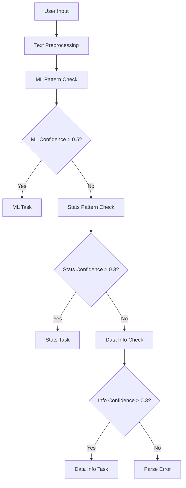

# Parser Module Documentation

## Overview

The parser module (`src/core/parser.py`) is a critical component of the Statistical Modeling Agent that converts natural language user requests into structured `TaskDefinition` objects. This enables the system to understand user intent and route requests to appropriate processing engines.

## Architecture

### Core Components

#### 1. Data Classes

**DataSource**
```python
@dataclass
class DataSource:
    file_id: Optional[str] = None          # Telegram file ID
    file_name: Optional[str] = None        # Original filename
    file_type: str = "unknown"             # csv, xlsx, json, parquet
    columns: Optional[list[str]] = None    # Available columns
    shape: Optional[tuple[int, int]] = None # (rows, columns)
```

**TaskDefinition**
```python
@dataclass
class TaskDefinition:
    task_type: Literal["stats", "ml_train", "ml_score", "data_info"]
    operation: str                         # Specific operation to perform
    parameters: dict[str, Any]             # Operation parameters
    data_source: Optional[DataSource]      # Associated data
    user_id: int                          # Telegram user ID
    conversation_id: str                  # Conversation context
    confidence_score: float = 0.0        # Parsing confidence (0-1)
```

#### 2. RequestParser Class

The main parser class that handles all natural language processing:

```python
class RequestParser:
    def parse_request(self, text: str, user_id: int,
                      conversation_id: str,
                      data_source: Optional[DataSource] = None) -> TaskDefinition
```

## Pattern Matching Strategy

### Statistical Patterns

The parser recognizes various statistical operations through regex patterns:

| Operation | Pattern Examples | Confidence Boost |
|-----------|------------------|------------------|
| `mean` | "calculate mean", "find average" | +0.8 |
| `median` | "show median", "middle value" | +0.8 |
| `std` | "standard deviation", "std", "stdev" | +0.8 |
| `correlation` | "correlation", "relationship" | +0.8 |
| `summary` | "descriptive stats", "overview" | +0.8 |

### Machine Learning Patterns

ML operations are detected with higher specificity requirements:

| Operation | Pattern Examples | Confidence Boost |
|-----------|------------------|------------------|
| `train` | "train model", "build classifier" | +0.9 |
| `predict` | "predict", "forecast", "score" | +0.9 |
| `regression` | "regression", "linear model" | +0.3 |
| `classification` | "classify", "categorize" | +0.3 |

### Column Extraction

Column names are extracted using multiple pattern strategies:

- **Direct reference**: `"for age column"` → extracts `age`
- **Quoted names**: `'"annual_income"'` → extracts `annual_income`
- **Target variables**: `"to predict salary"` → extracts `salary`
- **Features**: `"based on age, education"` → extracts `["age", "education"]`

## Request Classification Flow



## Confidence Scoring

The parser assigns confidence scores based on:

1. **Pattern Matches**: Each matched pattern adds confidence
2. **Completeness**: Presence of targets/features adds confidence
3. **Specificity**: More specific patterns get higher scores
4. **Context**: Multiple related patterns increase confidence

### Confidence Thresholds

- **High Confidence** (>0.7): Clear, unambiguous requests
- **Medium Confidence** (0.3-0.7): Partially clear requests
- **Low Confidence** (<0.3): Ambiguous or unrecognized requests (throws ParseError)

## Task Type Mapping

### Statistics (`stats`)

| Operation | Description | Parameters |
|-----------|-------------|------------|
| `descriptive_stats` | Basic descriptive statistics | `statistics: list`, `columns: list` |
| `correlation_analysis` | Correlation matrices | `statistics: ["correlation"]`, `columns: list` |
| `mean_analysis` | Single statistic analysis | `statistics: ["mean"]`, `columns: list` |

### Machine Learning (`ml_train`, `ml_score`)

| Operation | Description | Parameters |
|-----------|-------------|------------|
| `train_model` | Train ML model | `model_type: str`, `target: str`, `features: list` |
| `predict` | Make predictions | `model_type: str`, `target: str` |

### Data Information (`data_info`)

| Operation | Description | Parameters |
|-----------|-------------|------------|
| `describe_data` | Data overview | `{}` |

## Integration Points

### Bot Handlers Integration

```python
# In src/bot/handlers.py
from src.core.parser import RequestParser

async def message_handler(update: Update, context: ContextTypes.DEFAULT_TYPE):
    parser = RequestParser()
    try:
        task = parser.parse_request(
            text=update.message.text,
            user_id=update.effective_user.id,
            conversation_id=f"{update.effective_chat.id}_{update.message.message_id}"
        )
        # Route to orchestrator
        await orchestrator.process_task(task)
    except ParseError as e:
        await update.message.reply_text(f"I couldn't understand: {e.message}")
```

### Orchestrator Integration

The parser output feeds directly into the orchestrator:

```python
# In src/core/orchestrator.py
async def process_task(task: TaskDefinition) -> ProcessingResult:
    if task.task_type == "stats":
        return await stats_engine.process(task)
    elif task.task_type == "ml_train":
        return await ml_engine.train(task)
    elif task.task_type == "ml_score":
        return await ml_engine.predict(task)
    elif task.task_type == "data_info":
        return await data_engine.describe(task)
```

## Example Parsing Results

### Statistical Request
```python
Input: "Calculate mean and standard deviation for age column"
Output: TaskDefinition(
    task_type="stats",
    operation="descriptive_stats",
    parameters={
        "statistics": ["mean", "std"],
        "columns": ["age"]
    },
    confidence_score=0.8
)
```

### ML Training Request
```python
Input: "Train a random forest model to predict income based on age and education"
Output: TaskDefinition(
    task_type="ml_train",
    operation="train_model",
    parameters={
        "model_type": "random_forest",
        "target": "income",
        "features": ["age", "education"]
    },
    confidence_score=0.9
)
```

### Data Information Request
```python
Input: "Show me information about the data"
Output: TaskDefinition(
    task_type="data_info",
    operation="describe_data",
    parameters={},
    confidence_score=0.6
)
```

## Error Handling

### ParseError Scenarios

1. **Empty Input**: `""`
2. **Very Low Confidence**: `"random gibberish"`
3. **Ambiguous Requests**: `"do something"`

### Error Recovery Strategies

1. **Suggest Clarification**: Provide examples of valid requests
2. **Partial Parsing**: Extract what's possible and ask for missing info
3. **Context Hints**: Use conversation history for disambiguation

## Testing Strategy

### Unit Tests Coverage

The parser has comprehensive unit tests covering:

- **Dataclass Validation**: All edge cases and constraints
- **Pattern Matching**: Each pattern type with variations
- **Confidence Scoring**: Consistent and logical scoring
- **Column Extraction**: Various column reference formats
- **Error Handling**: All failure modes
- **Integration**: End-to-end parsing workflows

### Test Categories

1. **TestDataSource**: Dataclass functionality
2. **TestTaskDefinition**: Task definition validation
3. **TestRequestParser**: Core parser functionality
4. **TestStatsParser**: Statistical pattern matching
5. **TestMLParser**: ML pattern matching
6. **TestDataInfoParser**: Data information parsing
7. **TestColumnExtraction**: Column name extraction
8. **TestEdgeCases**: Error handling and edge cases
9. **TestIntegration**: Full workflow testing

## Performance Considerations

### Optimization Strategies

1. **Pattern Compilation**: Regex patterns are compiled once during initialization
2. **Early Exit**: ML patterns checked first (more specific)
3. **Confidence Thresholds**: Fail fast on very low confidence
4. **Minimal Processing**: Only extract what's needed

### Scalability

- **Stateless Design**: Parser instances can be created per request
- **Memory Efficient**: No large data structures cached
- **Thread Safe**: No shared mutable state

## Future Enhancements

### Planned Improvements

1. **Context Awareness**: Use conversation history for disambiguation
2. **Machine Learning**: Train custom NLU models for better accuracy
3. **Entity Recognition**: Named entity recognition for better column extraction
4. **Multi-language**: Support for non-English requests
5. **Fuzzy Matching**: Handle typos and variations
6. **Advanced ML**: Support for more model types and parameters

### Extension Points

1. **Custom Patterns**: Easy addition of new operation patterns
2. **Plugin Architecture**: Support for domain-specific parsers
3. **External NLU**: Integration with services like spaCy or Hugging Face
4. **Configuration**: Runtime pattern configuration

## Debugging and Monitoring

### Logging Strategy

The parser logs:
- **Request Text**: Truncated user input (first 100 chars)
- **Classification Results**: Task type and confidence
- **Pattern Matches**: Which patterns triggered
- **Extraction Results**: Columns, targets, features found

### Debug Information

```python
# Enable debug logging
import logging
logging.getLogger('src.core.parser').setLevel(logging.DEBUG)

# Example debug output
# INFO: Parsing request: calculate mean for age...
# DEBUG: Stats patterns matched: ['mean']
# DEBUG: Columns extracted: ['age']
# DEBUG: Final confidence: 0.8
```

### Monitoring Metrics

Key metrics to track in production:
- **Parse Success Rate**: Percentage of successful parses
- **Average Confidence**: Mean confidence score
- **Task Type Distribution**: Which operations are most common
- **Error Patterns**: Common failure modes

## API Reference

### Public Functions

```python
def parse_request(text: str, user_id: int, conversation_id: str,
                  data_source: Optional[DataSource] = None) -> TaskDefinition
```
Main parsing entry point.

```python
def extract_column_names(text: str) -> list[str]
```
Extract column references from text.

```python
def parse_stats_request(text: str) -> dict[str, Any]
```
Convenience function for statistical parsing.

```python
def parse_ml_request(text: str) -> dict[str, Any]
```
Convenience function for ML parsing.

### Configuration

Pattern dictionaries can be extended by subclassing `RequestParser`:

```python
class CustomParser(RequestParser):
    def _init_stats_patterns(self) -> dict[str, str]:
        patterns = super()._init_stats_patterns()
        patterns['custom_stat'] = r'my_custom_pattern'
        return patterns
```

This comprehensive parser module provides the foundation for natural language understanding in the Statistical Modeling Agent, enabling users to interact with complex data analysis functionality through simple conversational requests.